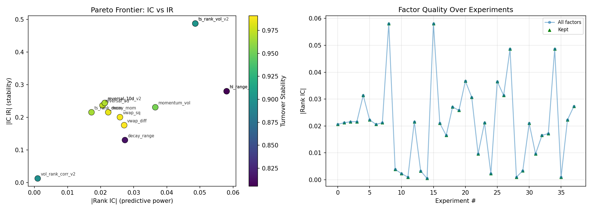
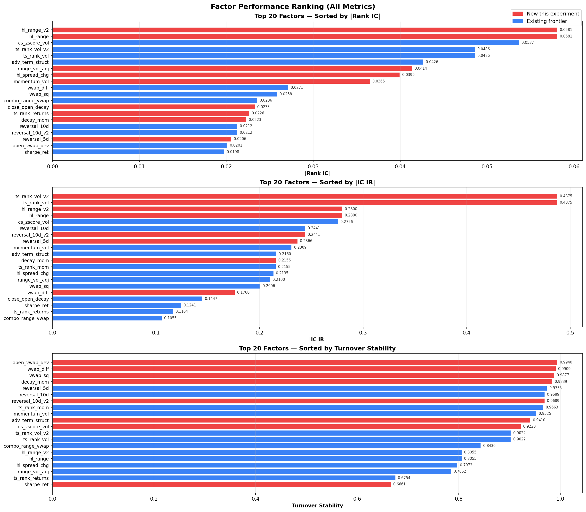

# Alpha Autoresearch

<p align="center">
  <b>Autonomous Alpha Factor Research for Chinese A-Shares</b><br>
  <i>AI agents invent, iterate, and optimize quantitative factors — while you sleep.</i>
</p>

<p align="center">
  
  
  
  
  
</p>

---

## 💡 What is this?

**Inspired by [Karpathy's autoresearch](https://github.com/karpathy/autoresearch)** — applied to quantitative finance.

An AI agent autonomously runs an experiment loop overnight:
1. Modifies `factors.py` — inventing new Alpha101-style factors
2. Evaluates against a unified dataset of 495 A-shares (2020–2025)
3. Checks 3 Pareto metrics — predictive power, stability, tradeability
4. Keeps only non-dominated factors, expanding the frontier

**~60 experiments/hour. ~500 overnight. Zero human intervention.**

```
┌──────────────┐     ┌──────────────┐     ┌──────────────┐
│  factors.py  │────▶│  prepare.py  │────▶│  3 metrics   │──▶ pareto_frontier.json
│ Agent edits  │     │  Read-only   │     │ RankIC/IR/TO │    (non-dominated)
└──────────────┘     └──────────────┘     └──────────────┘
```

---

## 🚀 Quick Start

```bash
git clone https://github.com/1998x-stack/alpha-autoresearch.git
cd alpha_autoresearch
uv sync                          # install deps
uv run python prepare.py         # evaluate factors (sample dataset included)
```

> **Out of the box.** Includes a 50-stock sample dataset (6.7 MB). No external data needed.
> For the full 495-stock dataset: `uv run python prepare.py --build-cache`

---

## 📊 Three First-Principles Metrics

A factor is only useful if it predicts returns, does so consistently, and is cheap to trade.

| Metric | Formula | Means |
|--------|---------|-------|
| **RankIC** | `mean(Spearman(factor, forward_return))` | Stronger predictive signal |
| **IC IR** | `mean(IC) / std(IC)` | More consistent predictions |
| **Turnover** | `1 − mean(|rank_t − rank_{t−1}|)` | Lower trading cost |

These form a **Pareto frontier** — you can't maximize all three simultaneously. The agent discovers the tradeoff surface.

---

## 🏗️ Architecture

| File | Role | Modified by |
|------|------|-------------|
| `prepare.py` | Evaluation harness — 12 operators, 3 metrics, Pareto logic | **Read-only** |
| `factors.py` | Factor definitions — 1–10 Factor subclasses per experiment | **AI agent** |
| `program.md` | Agent instructions — 6 iteration principles, loop protocol | **Human** |

### 12 Built-in Operators

`cs_rank` `cs_zscore` `ts_rank` `rolling_corr` `rolling_cov` `rolling_std` `rolling_sum` `rolling_min` `rolling_max` `delta` `delay` `decay_linear`

### 16 Data Columns

`open` `high` `low` `close` `volume` `vwap` `returns` `adv5`–`adv180`

---

## 🔬 Experiment Results

30 iterations, 38 factors generated, **0 crashes**.

<p align="center">
  
  
</p>

| Highlight | Factor | Value |
|-----------|--------|-------|
| 🥇 Best predictor | `hl_range` | IC = 0.0581 |
| 🥈 Most consistent | `ts_rank_vol` | IR = 0.49 |
| 🥉 Cheapest to trade | `vwap_diff` | Turnover = 0.991 |

📖 **[Full Experiment Report (Chinese)](docs/REPORT.md)**

---

## ✍️ Writing a Factor

```python
from prepare import Factor, ops

class Factor001(Factor):
    name = "momentum_5d"

    def compute(self, df):
        m = df.set_index(["datetime", "symbol"])
        val = ops.cs_rank(m["close"] - ops.delay(m["close"], 5))
        return Factor.as_cs_series(df, val)
```

That's it. Auto-discovered on next `uv run python prepare.py`.

---

## 🧪 Tests

```bash
uv run pytest tests/ -v     # 31 tests: 15 ops + 7 metrics + 9 Pareto
```

---

## 📚 Documentation

| | Language | Content |
|---|----------|---------|
| [README_ZH.md](docs/README_ZH.md) | 中文 | 完整项目文档 |
| [REPORT.md](docs/REPORT.md) | 中文 | 30 轮实验详细分析 |
| [CONTEXT.md](CONTEXT.md) | EN | Domain glossary |
| [program.md](program.md) | EN | Agent instruction file |

---

## ⚡ Design Principles

- **Single edit surface** — agent only touches `factors.py`
- **Immutable evaluation** — `prepare.py` never changes
- **Pareto optimization** — multi-objective, not single-number
- **Factor-count budget** — 10 factors/experiment, ~60/hour
- **Simplicity bias** — 3-line factor at IC=0.05 > 30-line at IC=0.051

---

## 📄 License

MIT
