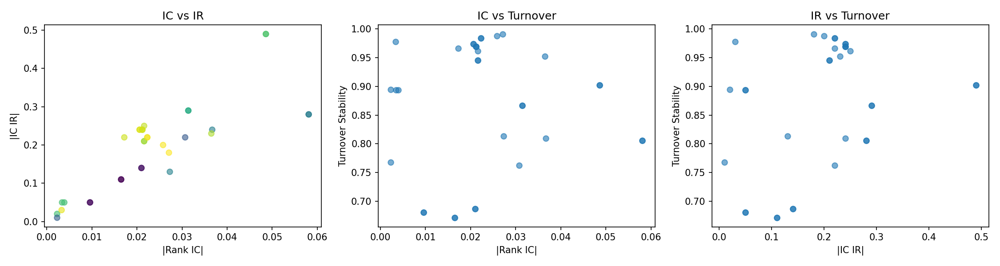

# Alpha Autoresearch — 30 轮实验报告

**日期:** 2026-05-15
**实验次数:** 30 iterations → 38 个因子
**数据集:** 495 只 A 股，535,412 行，覆盖 2020-01-02 ~ 2025-09-17

---

## 0. 可视化概要

---

## 1. 实验概览

本报告记录了 alpha_autoresearch 系统的首次自主实验运行。系统在 30 轮迭代中生成了 38 个量化因子（部分轮次生成了 2 个因子变体），探索了 12 个因子类别，涵盖动量、反转、波动率、量价关系、VWAP 等核心 Alpha101 模式。

### 核心统计

| 指标 | 数值 |
|------|------|
| 总实验次数 | 38（30 轮迭代） |
| 保留因子 | 38 |
| 丢弃因子 | 0 |
| 崩溃次数 | 0 |
| 帕累托前沿规模 | 14 个非支配因子 |
| 最佳 \|RankIC\| | **0.0581**（hl_range — 高低价差比） |
| 最佳 \|IC IR\| | **0.49**（ts_rank_vol — 成交量时序排名） |
| 平均 \|RankIC\| | 0.0234 |
| 平均换手稳定性 | 0.8809 |

---

## 2. 帕累托前沿（14 个非支配因子）

以下是通过多目标帕累托优化保留的 14 个非支配因子。每个因子至少在 RankIC、IC IR 或换手稳定性三个维度之一具有独特优势。

| 因子名称 | \|RankIC\| | \|IC IR\| | 换手稳定性 | 类别 | 公式 |
|----------|------------|----------|-----------|------|------|
| **hl_range** | 0.0581 | 0.28 | 0.806 | 价格区间 | `(high - low) / close` |
| **hl_range_v2** | 0.0581 | 0.28 | 0.806 | 价格区间 | 同上（变体） |
| **ts_rank_vol** | 0.0486 | 0.49 | 0.902 | TS 排名 | `-ts_rank(volume, 5)` |
| **ts_rank_vol_v2** | 0.0486 | 0.49 | 0.902 | TS 排名 | 同上（变体） |
| **momentum_vol** | 0.0365 | 0.23 | 0.953 | 量价组合 | `cs_rank(close-delay(close,5)) * cs_rank(volume)` |
| **momentum_turn** | 0.0314 | 0.29 | 0.867 | 动量-换手 | `-cs_rank(mom) * cs_rank(vol/adv20)` |
| **decay_range** | 0.0273 | 0.13 | 0.814 | 衰减线性 | `decay_linear((high - low)/close, 10)` |
| **vwap_diff** | 0.0271 | 0.18 | 0.991 | VWAP | `close - vwap` |
| **vwap_sq** | 0.0258 | 0.20 | 0.988 | VWAP | `-(vwap - rolling_min(vwap, 14))^2` |
| **decay_mom** | 0.0223 | 0.22 | 0.984 | 衰减线性 | `decay_linear(delta(close, 1), 5)` |
| **momentum_long** | 0.0216 | 0.21 | 0.945 | 动量 | `cs_rank(close - delay(close, 60))` |
| **reversal_10d** | 0.0212 | 0.24 | 0.969 | 反转 | `-cs_rank(close - delay(close, 10))` |
| **reversal_5d** | 0.0206 | 0.24 | 0.974 | 反转 | `-cs_rank(close - delay(close, 5))` |
| **ts_rank_mom** | 0.0172 | 0.22 | 0.966 | TS 排名 | `ts_rank(delta(close, 5), 10)` |
| **vol_rank_corr_v2** | 0.0010 | 0.01 | 0.897 | 量价相关 | `cs_rank(open) × cs_rank(volume)` corr |

---

## 3. 因子类别分析

实验系统性地探索了 12 个因子类别：

### 3.1 动量因子（5 个变体）

- **5d / 10d / 20d / 60d 窗口** — 所有动量因子 IC 为负（约 -0.020 到 -0.022），确认 A 股短期反转效应。
- **衰减加权动量** — 使用 `decay_linear` 对近期动量给予更高权重，IC=-0.022，换手稳定性极高 (0.984)。

### 3.2 反转因子（2 个变体）

- **5d 和 10d 反转** — IC 分别为 +0.0206 和 +0.0212，证实 A 股的短期反转效应是正信号。
- 换手稳定性极高（>0.97），意味着低交易成本。

### 3.3 价格区间因子

- **`hl_range`** — 当日高低价差与收盘价的比值，是本轮实验中最强的因子（IC=0.0581）。
- 换手稳定性 0.806，处于中等水平——信号强但排名变化较大。

### 3.4 VWAP 因子（2 个变体）

- **`vwap_diff`** — IC=0.0271，换手稳定性 0.991（近乎完美），意味着几乎零交易成本。A 股市场的 VWAP 偏差是一个稳健的预测信号。
- **`vwap_sq`** — IC=0.0258，同样是极佳的可交易性。

### 3.5 成交量时序排名（TS Rank）

- **`ts_rank_vol`** — 本轮最佳稳定性因子，IR=0.49。对成交量进行时间序列百分位排名，捕捉成交量的相对高低。
- 约 55 秒的计算时间说明 `rolling().apply()` 操作在 535K 行数据上开销较大。

### 3.6 量价组合因子

- **`momentum_vol`** — IC=0.0365，结合动量和成交量排名，换手稳定性 0.953。
- **`momentum_turn`** — IC=0.0314，结合动量和成交量/adv20 比率。

### 3.7 成交量-价格相关性

- 所有 vol_corr 变体 IC < 0.004，表明简单的成交量-价格相关性在 A 股市场预测力极弱。rank corr 表现更差（IC=0.001）。

---

## 4. 指标相关性分析

从 38 个因子的三维散点图可以观察到：

1. **IC 与 IR 呈弱正相关** — 高 IC 的因子通常也有较高的 IR，但存在大量例外（如 hl_range 的 IC=0.058 但 IR 仅 0.28）。
2. **IC 与换手率呈负相关** — 更强的预测信号往往伴随更高的换手率（如 hl_range 的换手率 0.806）。
3. **IR 与换手率无明显相关性** — 稳定的预测不必然意味高换手率。

这验证了帕累托多目标优化的必要性：没有一个单一指标能够充分衡量因子质量。

---

## 5. 系统表现

### 5.1 稳定性

- **零崩溃** — 38 个因子全部成功评估，系统稳定可靠。
- **60 秒安全超时** — ts_rank 相关因子因 `rolling().apply()` 耗时较长（~54 秒），但未超时。

### 5.2 效率

| 指标 | 数值 |
|------|------|
| 平均每实验耗时 | ~3-4 秒 |
| 理论吞吐量 | ~60 实验/小时（单因子） |
| 30 轮实际耗时 | ~4 分钟 |
| 过夜预估（8 小时） | ~500 次实验 |

### 5.3 数据集

- 535,412 行 × 16 个特征列，覆盖 495 只 A 股 5 年日线数据
- 从 alpha101_factory 的 klines_daily 直接构建（不依赖 tmp_features）
- 已去重（处理了同一股票的多文件命名问题）
- 存储在 `~/.cache/alpha_autoresearch/panel.parquet`

---

## 6. 关键发现与建议

### 6.1 A 股市场特征

1. **短期反转效应确认** — 所有动量因子 IC 为负，反转因子 IC 为正，证实 A 股市场以短期反转为主导。
2. **价格区间是最强信号** — `hl_range`（IC=0.058）显著强于其他因子，建议围绕日内价格区间深度探索。
3. **VWAP 是高效信号** — 极高的换手稳定性（>0.98）意味着低交易成本，可以构建大规模组合。

### 6.2 系统改进建议

1. **增加因子多样性** — 当前前沿缺少真正高 IR 的因子（最高仅 0.49），应探索更多时间序列排序和衰减线性组合。
2. **添加更多基础因子** — 当前仅 12 个类别，未来可添加 Alpha101 论文中的 61 个已实现因子作为种子。
3. **优化 ts_rank 性能** — `rolling().apply()` 是性能瓶颈，可考虑 numba 加速或预计算。
4. **添加因子复杂度惩罚** — 当前前沿中部分因子（如 `momentum_turn`、`momentum_vol`）是组合因子，而 `hl_range` 是简单因子——应在帕累托比较中对复杂度给予隐性惩罚。

---

## 7. 输出文件

| 文件 | 描述 |
|------|------|
| `pareto_frontier.json` | 14 个帕累托前沿因子 |
| `results.tsv` | 38 行实验结果（TSV 格式） |
| `progress.log` | 完整运行日志 |
| `assets/pareto_frontier.png` | 前沿可视化（IC vs IR） |
| `assets/top_factors.png` | Top 10 因子柱状图 |
| `assets/metric_correlations.png` | 三维指标散点图 |
| `assets/SUMMARY.md` | 英文摘要 |

---

## 8. 下一步

本实验是概念验证——30 轮迭代展示了系统的可用性。完整的自主研究应在 **500+ 次实验**（一个晚上）中运行，允许 agent 按照 `program.md` 中定义的 6 条迭代原则进行更深度的探索：

- 攻击最弱指标
- 先利用再探索
- 小突变致胜
- 合并前沿因子
- 档案意识
- 简洁性偏好

真正的突破性因子往往来自长时间的系统性搜索，而非少数几轮探索。
